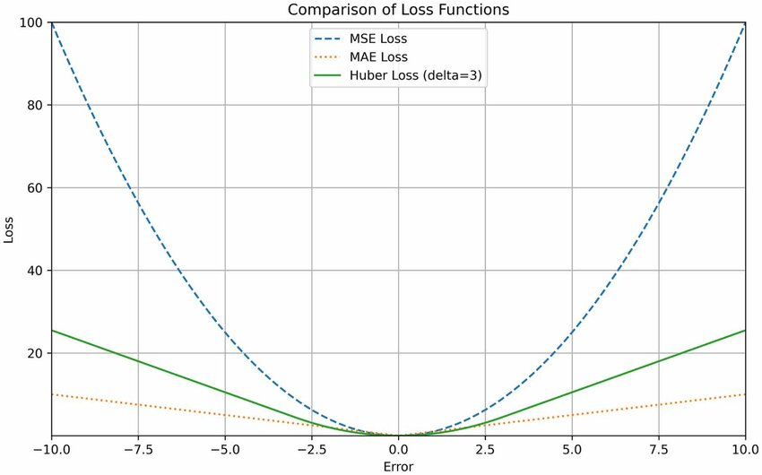

# Semana 02: [Estudar observações do Orientador (UA)]
**Período:** 21/09/2026 – 25/09/2026

## Trabalho planeado:
- Análise dos objetivos das Frameworks e das Métricas partilhadas pelo Orientador (UA)

## Trabalho diário realizado:
- **Seg (21/09) - Sex (25/09):** Objetivos e diferenças do que já está utilizado relativamente às novas Frameworks e Métricas (*)

---

#### (*) *Ideias e notas partilhadas pelo Orientador (UA) na reunião de dia 15/09:*
- ### Frameworks:
    - **Prophet**
        - O Prophet modela a série temporal \(y(t)\) como a soma de três componentes principais:
            $$
            y(t) = g(t) + s(t) + h(t) + \epsilon(t)
            $$

            - Onde:
                - \(g(t)\): **Tendência (Trend)**
                    - Captura as mudanças não-periódicas ao longo do tempo. Pode ser um modelo linear por partes (piecewise linear) ou logístico saturante;
                - \(s(t)\): **Sazonalidade (Seasonality)**
                    - Representa os padrões periódicos recorrentes (ex: diário, semanal, anual), modelados através de séries de Fourier;
                - \(h(t)\): **Feriados e Eventos (Holidays)**
                    - Modela o efeito de feriados ou eventos especiais, com parâmetros dedicados para cada um;
                - \(\epsilon(t)\): **Termo de Erro (Error Term)**
                    - Representa o ruído ou a variabilidade não explicada pelo modelo.

    - **Neural Prophet:**
        - O NeuralProphet modela a série temporal \(x_t\) (ou \(y(t)\)) como uma soma modular de componentes:
            $$
            x_t = T(t) + S(t) + E(t) + F(t) + A(t) + L(t)
            $$

        - Onde:
            - \(T(t)\): **Tendência (Trend)**. Similar ao Prophet, pode ser uma tendência linear ou linear por partes, com pontos de mudança (changepoints);
            - \(S(t)\): **Sazonalidade (Seasonality)**. Modelada com termos de Fourier, suportando múltiplas sazonalidades;
            - \(E(t)\): **Eventos e Feriados (Events/Holidays)**. Efeitos de eventos especiais ou feriados, tratados como covariáveis com coeficientes dedicados;
            - \(F(t)\): **Regressores Futuros (Future Regressors)**. Efeitos de variáveis exógenas cujos valores futuros são conhecidos no momento da previsão;
            - \(A(t)\): **Autorregressão (Autoregression)**. Captura a dependência dos valores passados da própria série, implementada através de uma rede neuronal feed-forward (AR-Net);
            - \(L(t)\): **Regressores Desfasados (Lagged Regressors)**. Efeitos de variáveis exógenas cujos valores futuros **não** são conhecidos, sendo usado apenas o seu histórico (valores desfasados).

    - **Anova:**
        - Ferramenta estatística para entender o passado e filtrar o que realmente importa antes de treinar qualquer modelo;

        - **NOTA** (diferença entre *Anova* e o *Prophet*):
            - O *Prophet* e o *Neural Prophet* são importantes, pois são os motores para prever o futuro;
            - *Anova* já é uma ferramenta de filtragem.

        - Exemplo:
            - Imaginemos que queremos saber se a escolha da transportadora tem impacto real no tempo de atrasos das entregas:
                - *Anova* divida a variâncai total dos dados em dois blocos:
                    - **Variância entre grupos** - Quão distantes estãos as médias de atrasos de cada transportadora em relação à média global;
                    - **Variância dentro dos grupos** - O ruído que cada transportadora tem no seu dia a dia.
                
                - **Fórmula:**
                    $$
                    \frac{\text{Variância entre os transportes (sinal)}}{\text{Variância dentro de cada transportadora (ruído)}}
                    $$

                - Se *$F \approx 1$ e $p > 0.05$*, os transportes têm comportamentos praticamente idênticos. Esta variável é ruído inútil para o modelo.

                - Se *$F \gg 1$ e $p < 0.05$*, a diferença de pontualidade entre transportes é expressiva, então esta compõe uma feature importante para o modelo.

        - **Fluxo**
            - Dados - Feature Engineering - Feature Selection (ANOVA) - Treino dos modelos - Performance

---

- ### Métricas:
    - **MCC** - *Matthews Correlation Coefficient*
        - Métrica de validação para **modelos de classificação**;
        - **Fórmula:**
            $$
            \text{MCC} = \frac{TP \cdot TN - FP \cdot FN}
            {\sqrt{(TP+FP)(TP+FN)(TN+FP)(TN+FN)}}
            $$

        - **Interpretação**:
            - Varia entre: 
                - '-1' -- discordância total;
                - '0' -- predict aleatório;
                - '1' -- previsão perfeita.

    - **HUbber loss** - *Smooth Mean Absolute Error*:
        - Função de perda usada para treinar e avaliar **modelos de regressão**;
        - **NOTA:**
            - Se usarmos **MSE** (Mean Square Error): Os outliers dominam o gradiente e puxam a previsão geral para cima;
            - Se usarmos **MAE** (Mean Absolute Error): Não é contínua em zero o que pode dificultar a convergência.

        - **Fórmula:**

            $$
            L_\delta(y, \hat{y}) =
            \begin{cases}
            \dfrac{1}{2}(y - \hat{y})^2 & \text{se } |y - \hat{y}| \le \delta \\[6pt]
            \delta \cdot \left(|y - \hat{y}| - \dfrac{1}{2}\delta\right) & \text{caso contrário}
            \end{cases}
            $$

            - Onde:
                - $y$: valor real
                - $\hat{y}$: valor previsto
                - $\delta > 0$: parâmetro que define o ponto de transição entre a zona quadrática e a zona linear

        - **NOTA:**
            - Para pequenos desvios, comporta-se quadraticamente como o **MSE**:
            $$
            \text{se } |y - \hat{y}| \le \delta
            $$
            - Para grandes erros, torna-se linear como o **MAE** (não explode com outliers):
            $$
            \text{se } |y - \hat{y}| > \delta
            $$

        
        - **Detalhe:**
            - O hiperparâmetro $\delta$ define a fronteira exata entre o que consideramos "ruído operacional tolerável".

    - **Diagrama da Huber Loss**:
        
        

---

## Próximos Passos:
- Identificar artigos de estudo para leitura e análise